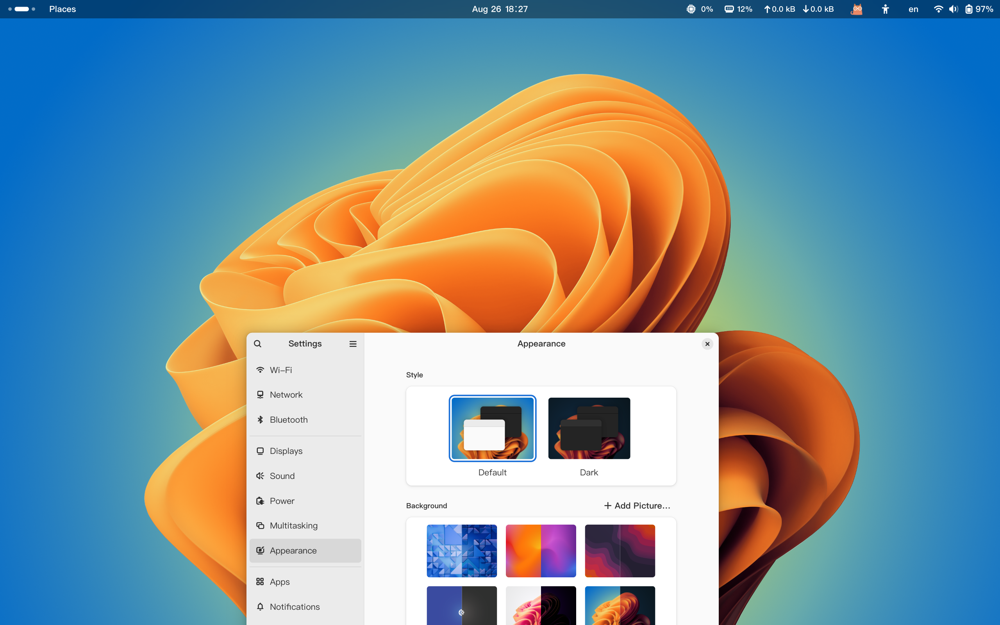

Add more fantastic wallpapers to your Gnome wallpaper library !

> [!CAUTION]
>
> Disclaimer: Most of wallpapers are collected from the
> internet, if this repo has violated your copyright, 
> please contact me for removal.
>

## Installation

Wallpapers can be installed via flake. At first, this repo must be added into flake's `inputs` section:

```nix
# flake.nix
{
  # ... 
  inputs = {
    # ...

    # add this to your flake inputs section
    dynamic-gnome-wallpapers.url = "github:Erven2016/dynamic-gnome-wallpapers.nur/master";

    # ...
  };
  # ...
}
```

Then adding below configuration to add an overlay to nixpkgs:

```nix
# flake.nix
{
  # ...
  outputs = inputs@{
    # ...
    dynamic-gnome-wallpapers
    # ...
  }:
  let
    # ...

    genericModules = [
      (
        {config, pkgs, ...}:
        {
          nixpkgs.overlays = [
            # ...
            overlay-nur-dynamic-gnome-wallpapers
            # ...
          ];
        }
      )
    ];

    overlay-nur-dynamic-gnome-wallpapers = final: prev: {
      dynamic-gnome-wallpapers = import dynamic-gnome-wallpapers {};
    };

    # ...
  in
  {
    nixosConfigurations."hostname" = nixpkgs.lib.nixosSystem {
      # ...

      modules = genericModules ++ [
        # ... your other modules
      ];

      # ...
    };
  }
}
```

Then add wallpaper package to your configuration.nix or other nix module files:

```nix
# configuration.nix or other nix modules
{ pkgs, ... }
{
  # ...

  enviroment.systemPackages = with pkgs.dynamic-gnome-wallpapers; [
    moon-far-view
    macos-ventura
    macos-sonoma
    # ...
  ];

  # ...
}
```

or importing wallpapers with home-manager:

```nix
# home.nix or other home-manager modules
{ pkgs, ... }:
{
  # ...

  home-manager.user."your-user-name" = {
    # ...

    home.packages = with pkgs.dynamic-gnome-wallpapers; [
      macos-ventura
      macos-sonoma
      moon-far-view
    ];

    # ...
  };

  # ...
}
```

You need to rebuild your nixos in the last step, enjoy!